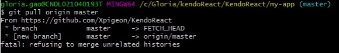
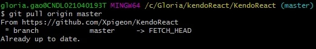
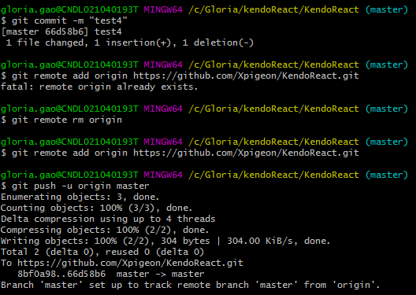

在向github上传代码时，push过程中提示如下错误：

很明显，错误的提示说push之前先pull，所以接下来执行了pull：

但在此次pull执行之后，显示拒绝了相关合并。
对于错误提示 **fatal：refusing to merge unrelated histories** 是指在pull时合并两个不同提交的仓库，怀疑二者不是同一个，为了防止上传错误给出的提示。此时如果想要继续合并仓库执行 ：
**$ git pull origin master --allow-unrelated-histories**
然而出现该问题的原因不在于此，而是因为pull的目录路径不对。所以退出my-App，在根目录中执行pull

如果执行 git remote add origin 时出现错误提示 **fatal: remote origin already exists**，则需要执行：
 **$ git remote rm origin**
先删除远程的git仓库，再重新添加。