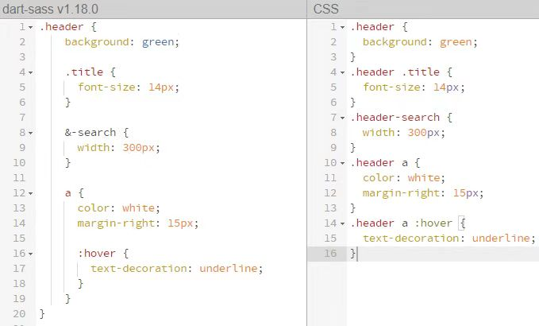

在我之前参与的项目里，所有的样式都是用css来编写的。因为每个人负责各自的功能模块，导致每一部分的样式都各不相同。这种方式带来的最大问题是：对于同一个组件样式却不相同，想要做统一规范时要修改多处，麻烦且效率低。而且对于单页面程序，在打包压缩之后，会遇到因为命名相同造成样式互相影响的问题。

Sass是css的预处理器。详细的使用教程可以在[Sass官网](https://sass-lang.com/documentation)查看，官网也提供了[在线转换器](https://www.sassmeister.com)，方便对比Sass与css的写法区别。


以下是我自己对于Sass的一些总结，方便以后的使用和学习。

Sass有两种语法： 一种是SCSS(文件以 .scss 命名)，兼容了css的语法。另一种是SASS (文件以 .sass 命名)，省略了花括号和分号，通过缩进的方式表达嵌套。（缩进语法老旧不推荐使用）


### **1.嵌套**

下图列举几种使用频繁的嵌套语法。左边为sass，右边对比常见的css写法：



### **2.变量**

使用变量代替直接使用值本身，可以做统一的修改。变量以$开头:
``` python
$color: green;
.title {
 background: $color;
}
```

也可以把变量镶嵌在字符串之中，写在#{ }之中：

``` python
$side : left;
.rounded {
 border-#{$side}-radius: 5px;
}
```
设置default，当引入此部分样式文件时，如果声明了同名变量且设置新值，则使用新值，否则使用default值。
``` python
$color: green !default;
.title {
 background: $color;
}
```

### **3.注释语法**

静默注释，即// 注释掉的内容不会出现在生成的css文件中
（快速记法：单行//不出现，多行/* xxx */出现）

``` python
body {
  color: green; // 注释内容不会出现在生成的css文件中
  padding: 0; /* 注释内容会出现在生成的css文件中 */
}
```

### **4.继承**

sass通过@extend语法实现css的样式继承，当一个元素拥有的类（seriousError）表明它属于另一个类（error），这时使用继承再合适不过。

``` python
.error {
 width: 30px;
 background-color: red;
}
.seriousError {
  @extend .error;
  border-width: 3px;
}
```
除了可以对class类使用继承，对于css规则同样也可以，比如：
 @extend a  继承a标签样式

### **5.混合器**

混合器可以用来实现大段样式的重用。混合器使用 @mixin 标识符定义，这个标识符给一大段样式定义一个名字，通过引用这个名字重用这段样式。

``` python
@mixin round-border {
 border-radius: 5px;
}
// 以下引用
notice {
 width: 30px;
 border: 2px solid green;
 @include round-border;
}
// 最终生成
.notice {
 width: 30px;
 border: 2px solid green;
 border-radius: 5px;
}
```
同时，混合器里也可以使用css规则，以及使用sass的父选择器标识符&。在include处的节点，继续引入子节点设置样式