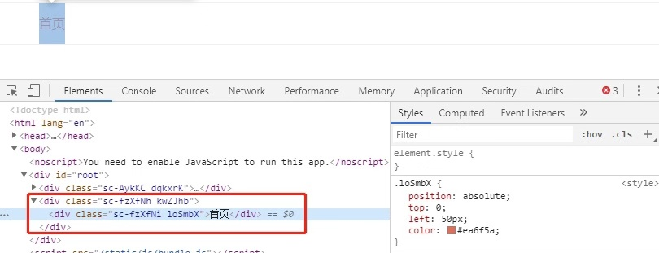

最近在一个React相关的教学课程中发现有使用styled-components创建组件的方式，于是去[官网](https://www.styled-components.com/docs)看了下（只找到英文官网...）
官方介绍：“styled-components是React中的一种样式方案，具备了 css-in-js 的模块化优点，并且使用CSS的书写习惯上手更方便” 
通过使用在js里直接嵌入css的方式，完成对每个组件添加样式的设置，针对每一个独立的组件。


首先，执行以下命令安装：

``` python
npm install --save styled-components
```

在以前的版本中使用自带的**injectGlobal**方法来设置全局样式，目前已经废弃，引入会报错，使用**createGlobalStyle**方法替换。


``` python
import React from 'react';
import {createGlobalStyle} from 'styled-components';

const GlobalStyled = createGlobalStyle`
body{
    margin:0;
    padding:0;
}`

class App extends React.Components{
 render(){
     return <GlobalStyled />
 }
}
```


以下是创建普通组件的方法，与上面例子写法类似，引入styled创建组件HeaderWrapper和Header，分别设置各自样式：

``` python
import React from "react";
import styled from "styled-components";

const HeaderWrapper = styled.div`
    position: relative;
    height: 50px;
    line-height: 50px;
    border-bottom: 1px solid #f0f0f0;
`

const Header = styled.div`
    position: absolute;
    top: 0;
    left: 50px;
    color: #ea6f5a;
 &: hover{
     cursor: pointer;
  }
`

class Header extends React.Component {
 render (){
  return (
   <HeaderWrapper>
    <Header>首页</Header>
   </HeaderWrapper>
  );
 }
}
```

编译后，在界面中渲染出来的如下图，给两个div组件加上了一串随机的className，有效的避免全局css样式的污染。

