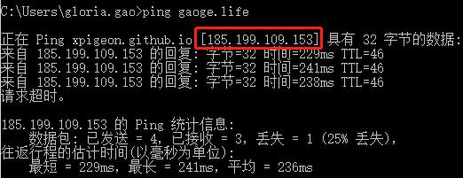
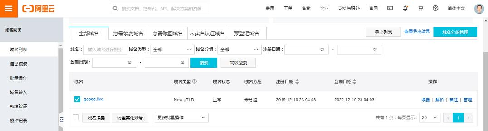
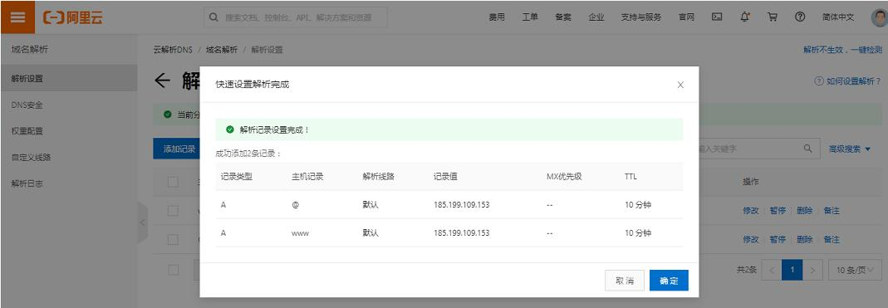
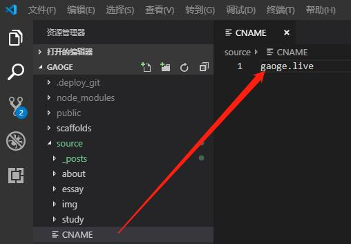
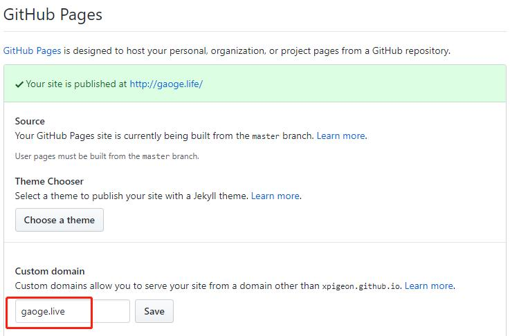

之前的域名过期了，不打算续用。在阿里新选了域名后，更换域名的使用，以下为更换步骤：

> 博客使用hexo搭建，服务器是用github的，域名默认为github下的二级域名：xpigeon.github.io

### **1.获取IP地址**
cmd下ping原先的博客，得到IP地址[185.199.109.153]

### **2.域名解析**
在阿里云的**管理控制台-域名与网站-域名**可以查看当前购买的域名及其状态，未认证需要实名认证。选中后**操作-解析**

进入域名解析设置后，进入**新手指导**，将上面的IP地址填到记录值中，填完后如下：

### **3.设置CNAME**
项目中在**source**文件夹下创建CNAME文件，内容为购买的域名

### **4.GitHub上的设置**
打开github上的xpigeon.github.io项目的**Settings**，在**Github Pages**部分找到**Custom domain**设置上域名。

 
 **Save**成功，配置完成。