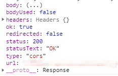

全局 fetch 函数是 web 请求和处理响应的简单方式，XMLHttpRequest的使用相对比较复杂。但fetch存在一些兼容性问题，例如IE8以下不支持，需要使用Fetch Polyfill 为不支持的浏览器重新创建功能。


对于传统的XMLHttpRequest而言，必须使用它的一个实例来执行请求和检索返回的响应。 但是通过Fetch API 能够明确的配置请求对象。


fetch请求会接受两个参数，返回一个promise对象。下面是一个简单的栗子：
``` python
const path: string = "https://cn.bing.com/"
const options = { 
        method: 'GET',
    headers: new Headers(),
    mode: 'cors',
    credentials: 'include' //支持跨域调用
    // POST请求时，提供要提交的表单信息 body: JSON.Stringify({name:a}) 
};

fetch(path, options).then(response => {
        if(response.ok) {
                return response.json();
        }
        throw new Error('Network response not ok.');
}).catch(error => {
        console.error('Error:', error)
})
```


**Headers**

可以通过has/get进行查询和获取

``` python
const content: string = "Hello";
myHeaders = new Headers({
        "Content-Type": "text/plain",
        "Content-Length": content.length.toString(),
        "X-Custom-Header": "ProcessThisImmediately",
});

myHeaders.has("Content-Type") // true
myHeaders.has("Content-Length") // 5
```

**Response对象**
当fetch() promise被解析时，Response实例被返回，以下是控制台打出的一个Response对象 。



有图可见，response对象上有一些属性Response.status，Response.statusText，Response.ok等

Response对象还有一些其他的方法：
1. Response.clone()：创建一个Response对象的克隆
2. Response.error()： 返回一个绑定了网络错误的新的Response对象
3. Response.blob()：返回一个被解析为Blob格式的promise对象，并且将它设置为已读（只能被读取一次）
4. Response.formData()：返回一个被解析为FormData格式的promise对象
5. Response.json()：返回一个被解析为JSON格式的promise对象
6. Response.text()：返回一个被解析为USVString格式的promise对象


**目前Fetch还没有提供取消请求的方法**
