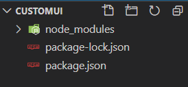
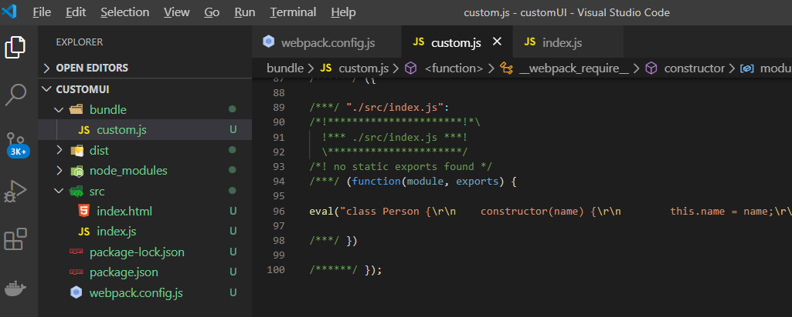

> webpack 是一个现代 JavaScript 应用程序的静态模块打包器。它会递归地构建一个依赖关系图，包含应用程序需要的每个模块，然后将所有模块打包成一个或多个 bundle。

一. webpack有以下五个核心概念：
- **入口(entry)** ：webpack会根据设置的入口文件，一直向下查找直接或间接的依赖，构建出一整个内部依赖图。默认值**"./src"**
- **输出(output)** ：webpack创建的bundles的输出位置。默认值**"./dist"**
- **转换器(loader)** ：将所有类型文件转换成webpack能处理的有效文件（webpack 自身只理解 JavaScript）
- **插件(plugins)** ：处理比loader范围更广的任务，包括压缩，优化打包等。
- **模式(mode)** ：通过设置development/production，来启用不同模式下webpack不同的内置优化。


二. 初始化项目，安装webpack（安装前确保已安装Node.js）

1. 新建文件夹，或者github新建respository。我的文件夹**customUI**，终端打开执行 `npm init -y`  进行初始化（也可以yarn）。

2. 在 webpack4 里将内核和cli进行了分离，所以需要分别安装webpack和webpack-cli，执行  `npm install webpack webpack-cli -D`
 
 其中：
 （1） -D 是 --save-dev的简写，表示将依赖安装在devDependencies里
 （2）安装完成后可以通过`npx webpack -v` 查看安装的版本号
 


 此时可以看到目录中生成了三个文件：
 
 - node_modules：依赖包
 -  package-lock.json：用来记录当前状态下实际安装的各个npm package的具体来源和版本号
 - package.json：模块的描述文件

-------------------
初始化已完成，接下来需要进行webpack文件内部配置

-------------------
3. 配置**entry**入口
在当前目录下创建一个  `webpack.config.js` 文件，首先配置entry：

``` python
module.exports = {
    entry: './src/index.js',
}
```
**entry** 的值：
（1）字符串：单文件入口
（2）数组：多个主入口
（3）对象：可扩展的定义方式

``` python
module.exports = {
    entry: {
        custom: './src/custom.js',
        app: './src/app.js',
    }
}
```

4. 配置**output**出口
向硬盘写入编译文件，只能有一个输出。

``` python
const path = require('path');

module.exports = {
    entry: './src/index.js',
    output: {
            filename: 'custom.js',
            path: path.resolve(__dirname, 'bundle')
        }
}
```

5. 配置**babel-loader**，将高版本包括ES6，ES7等转换成低版本JS

（1）新建文件夹**src**，创建文件**index.js**，随便写一些：
``` python
class Person {
    constructor(name) {
        this.name = name;
    }
    getName() {
        return this.name;
    }
}

const person = new Person("Tom");
```
（2）此时可以进行构建 `npx webpack --mode=development` （默认是 production 模式），执行后可以看到在当前目录下出现上一步output时设置的bundle文件夹，并且包含一个custom.js文件



 可以看到，main.js里并没有被转义为低版本

（3） 安装babel-loader，执行 `npm install babel-loader -D`