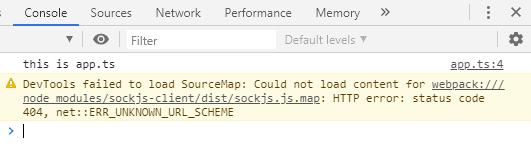

> webpack 是一个现代 JavaScript 应用程序的静态模块打包器。它会递归地构建一个依赖关系图，包含应用程序需要的每个模块，然后将所有模块打包成一个或多个 bundle。

一. webpack有以下五个核心概念：
- **入口(entry)** ：webpack会根据设置的入口文件，一直向下查找直接或间接的依赖，构建出一整个内部依赖图。默认值**"./src"**
- **输出(output)** ：webpack创建的bundles的输出位置。默认值**"./dist"**
- **转换器(loader)** ：将所有类型文件转换成webpack能处理的有效文件（webpack 自身只理解 JavaScript）
- **插件(plugins)** ：处理比loader范围更广的任务，包括压缩，优化打包等。
- **模式(mode)** ：通过设置development/production，来启用不同模式下webpack不同的内置优化。


二. 初始化项目，安装webpack（安装前确保已安装Node.js）


1. 新建文件夹，或者github新建respository。我的文件夹**customUI**，终端打开执行 `npm init -y`  进行初始化（也可以yarn）。


2. 在 webpack4 里将内核和cli进行了分离，所以需要分别安装webpack和webpack-cli，执行  `npm install webpack webpack-cli -D`
 
 其中：
 （1） -D 是 --save-dev的简写，表示将依赖安装在devDependencies里
 （2）安装完成后可以通过`npx webpack -v` 查看安装的版本号
 


 此时可以看到目录中生成了三个文件：
 
 - node_modules：依赖包
 -  package-lock.json：用来记录当前状态下实际安装的各个npm package的具体来源和版本号
 - package.json：模块的描述文件


初始化已完成，接下来需要进行webpack文件内部配置


3. 配置**entry**入口
在当前目录下创建一个  `webpack.config.js` 文件，首先配置entry：

``` python
module.exports = {
    entry: './src/index.js',
}
```
**entry** 的值：
（1）字符串：单文件入口
（2）数组：多个主入口
（3）对象：可扩展的定义方式

``` python
module.exports = {
        entry: {
                custom: './src/custom.js',
                app: './src/app.js',
    }
}
```


4. 配置**output**出口
向硬盘写入编译文件，只能有一个输出。

``` python
const path = require('path');

module.exports = {
    entry: './src/index.js',
    output: {
            filename: 'custom.js',
            path: path.resolve(__dirname, 'bundle')
        }
}
```
其中：
（1）const path = require('path');  直接引用。node中自带的模块
（2）__dirname 是node的内置变量


5. 配置**babel-loader**，将高版本包括ES6，ES7等转换成低版本JS

（1）新建文件夹**src**，创建文件**index.js**，随便写一些：
``` python
class Person {
    constructor(name) {
        this.name = name;
    }
    getName() {
        return this.name;
    }
}

const person = new Person("Tom");
```
（2）此时可以进行构建 `npx webpack --mode=development` （默认是 production 模式），执行后可以看到在当前目录下出现上一步output时设置的bundle文件夹，并且包含一个custom.js文件


 可以看到，custom.js里并没有被转义为低版本

（3） 安装babel-loader，执行 `npm install babel-loader -D`

在配置babel同时，需要安装以下依赖：

`npm install @babel/core @babel/preset-env @babel/plugin-transform-runtime -D`
`npm install @babel/runtime @babel/runtime-corejs3`

babel7详细问题可以参见这篇文章[不容错过的 Babel7 知识](https://juejin.im/post/5ddff3abe51d4502d56bd143)

webpack中添加如下配置：
``` python
module.exports = {
    ...
    module: {
        rules: [
            {
                test: /\.jsx?$/,
                use: {
                    loader: 'babel-loader',
                    options: {
                        presets: ["@babel/preset-env"],
                        plugins: [
                            [
                                "@babel/plugin-transform-runtime",
                                {
                                    "corejs": 3
                                }
                            ]
                        ]
                    }
                },
                exclude: /node_modules/ //排除 node_modules 目录
            },
        ]
    }
}
```
给loader添加exclude，表示此目录不需要我们编译，可以有效提升编译效率。

（4）新建文件.babelrc
``` python
{
    "presets": ["@babel/preset-env"],
    "plugins": [
        [
            "@babel/plugin-transform-runtime",
            {
                "corejs": 3
            }
        ]
    ]
}
```
（5）此时可以执行`npx webpack --mode=development` 构建。

解释loader所需的配置：
- **module对象里有一个数组rules**：数组的每一项为我们设置的loader 
- **数组rules中可以包含多个对象**：每一个对象有 test 和 use两个属性 
- **test**：   是一个字段匹配的规则，对应处理符合规则的文件
- **use**：
① 可以是一个字符串，例如 `use: 'babel-loader'`
② 可以是一个数组，例如 `use: ['style-loader', 'css-loader']`
③ 可以是一个对象，例如
``` python
module: {
        rules: [
            {
                test: /\.jsx?$/,
                use: {
                    loader: 'babel-loader',
                    options: {
                        presets: ["@babel/preset-env"]
                    }
                },
                exclude: /node_modules/
            }
        ]
}
```


6. 配置**ts-loader**，可以对TypeScript语法进行编译
（1） 初始化安装TypeScript以及其对应的loader转换器  
`npm install typescript -D`  
`npm install ts-loader -D`   

（2） 新建一个 **tsconfig.json** 文件 ，具体配置参见[官方文档](https://www.typescriptlang.org/docs/handbook/tsconfig-json.html) ，以下是我的简单配置：

``` python
{
    "compilerOptions": {
        "module": "commonjs",
        "outDir": "./bundle",
        "target": "es5",
        "allowJs": true, // 允许js语法再ts环境运行
    },
    "exclude": [
        "./node_modules"  
    ]
}
```
（3）新建一个app.ts

``` python
import "./index.scss";

console.log('this is app.ts');
```


7. 配置**css-loader**和**style-loader**, 处理样式文件
执行`npm install css-loader style-loader sass-loader node-sass -D`

在webpack.config.js中添加：
``` python
module: {
        rules: [
            ...
            {
                test: /\.s?css$/,
            use: ['style-loader', 'css-loader', 'sass-loader'],
            exclude: /node_modules/
        }
        ]
}
```

此时在当前目录新建一个index.scss，随便添加一个测试样式：

``` python
$color: yellow;
body{
    background: $color;
}
```

其中：
（1）style-loader：动态创建style标签，将css插入到head中
（2）css-loader：负责处理 @import 等语句 
（3）sass-loader：负责处理编译 .scss文件，将其转为css


8.  处理图片/字体文件，配置**file-loader**和**url-loader**
执行 `npm install url-loader file-loader -D`

``` python
module: {
        rules: [
                ...
             {
            test: /\.(jpe?g|png|gif|svg|ico)$/i,
            use: [{
                loader: 'file-loader',
                options: {
                    limit: 10240,
                    outputPath: 'imgs'
                }
            }],
            exclude: /node_modules/
        },
        ]
}
```

其中：
（1）file-loader与url-loader功能类似，可以设置limit范围，如例子中的 **limit: 10240**，表示当资源大小小于10K时，将其转换为base64，超过10k，将图片打进文件，且设置了一个文件输出路径，在imgs文件夹下。


9. 添加完基本的loader配置后，我们需要查看在浏览器中显示的效果。
（1）使用html-webpack-plugin 插件来完成，执行 `npm install html-webpack-plugin -D`

``` python
const HtmlWebpackPlugin = require('html-webpack-plugin');
const isDev = process.env.NODE_ENV === 'development';

module.exports = {
    ...
    mode: isDev ? 'development' : 'production',
        plugins: [
        new HtmlWebpackPlugin({
            template: './src/index.html',
            filename: 'index.html',
            minify: {
                removeAttributeQuotes: false, //是否删除属性的双引号
                collapseWhitespace: false, //是否折叠空白
            },
        })
    ]
}
```
其中：
- 安装完成后，使用require将该插件引入，并通过new创建一个实例对象。
- plugins是一个数组，可以设置多个插件
- template：设置一个输入口
- filename：打包后的文件名

（2）安装**webpack-dev-server**  执行 `npm install webpack-dev-server -D`

``` python
"scripts": {
    "dev": "webpack-dev-server",
    "build": "webpack"
}
```
在控制台执行`npm run dev` ，就可以正常启动页面了。


界面打开后，可以直观的看到我的css已经设置成功，打开控制台，ts文件中的console也输出了，但有一个警告：



10. 设置**devtools**
devtool 中的一些设置，可以帮助我们将编译后的代码映射回原始源代码，不同的值会明显影响到构建和重新构建的速度。
``` python
devtool: isDev ? 'source-map' : 'none'
```