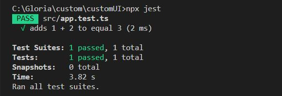

> 挂[Jest官网](https://jestjs.io/zh-Hans/)

-------------------

1. 使用npm安装jest依赖，执行 `npm install -D jest typescript`

-------------------

2. 因为我要用TS写case，所以需要安装  **ts-jest** 相关依赖，执行 `npm install -D ts-jest @types/jest`

-------------------

3. 依赖安装完成后，在 **package.json**中，添加设置：
``` python
{
    "scripts": {
        "dev": "webpack-dev-server",
        "build": "webpack",
        "test": "jest"
    }
}
```
添加后，可以在终端执行  `npm run test`来执行测试的代码

-------------------

4. 创建一个 **jest.config.js**文件，并添加以下配置：
``` python
module.exports = {
    preset: "ts-jest",
    transform: {
      '^.+\\.tsx?$': 'ts-jest',
    },
    testRegex: '(/__tests__/.*|(\\.|/)(test|spec))\\.(jsx?|tsx?)$',
    moduleFileExtensions: ['ts', 'tsx', 'js', 'jsx', 'json', 'css', 'scss', 'node'],
}
```

-------------------

5. 添加一个 **app.ts** 文件并在其中定义一个方法sum，如下：

``` python
const sum = (a: number, b: number): number => {
    return a + b;
}

export default sum;
```

-------------------

6. 同级目录下添加一个 **app.test.ts**文件，命名与其要测的功能文件相同，在其后添加一个test标志，在该文件中引入要测试 sum 方法，并编写测试代码：

``` python
import sum from './app';

test('adds 1 + 2 to equal 3', () => {
    expect(sum(1, 2)).toBe(3);
});
```

-------------------

7. 此时，已完成基本配置并添加一条测试case，可以执行 **npx  test** 或者 **npm run test** 来运行。运行后，终端报错如图：


-------------------

8. 提示我需要在 **tsconfig.json** 的文件中，设置 **esModuleInterop** ： **true**

-------------------

9. 设置完成后重新test，执行成功！且在终端打出如下信息：



-------------------

下一篇将总结一些jest中常用的API，撒花~