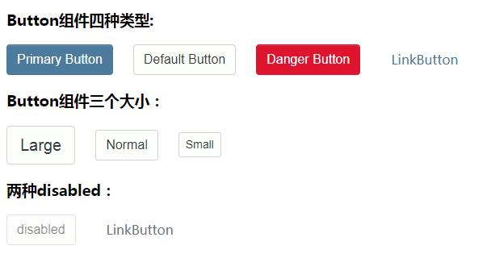
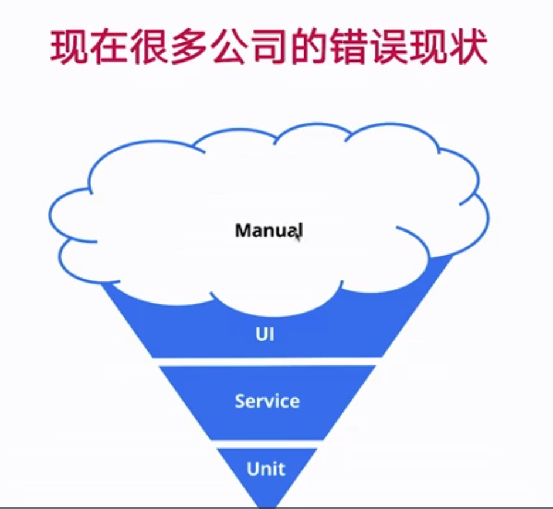

> 组件库源码已上传至[github/leapFrog](https://github.com/Xpigeon/leapFrog)，感兴趣霜鸡~ 

---

button组件需求分析：



---

问题总结：


1. 如何**继承**button标签和a标签上**自带的属性/方法**？

react为组件提供了方法:

button标签使用：`React.ButtonHTMLAttributes<HTMLElement>`

a标签使用：`React.AnchorHTMLAttributes<HTMLElement>`

---

2. 使用**交叉类型**将自定义的props与标签自带的属性/方法合并：

`NativeButtonProps = React.ButtonHTMLAttributes<HTMLElement> & BaseButtonProps;`
`AnchorButtonProps = React.AnchorHTMLAttributes<HTMLElement> & BaseButtonProps;`

---

3. 如何将**所有属性/方法都设置为可选**？

TS提供了**Partial**方法，可以将接口内所有的属性/方法改为可选。

`export type ButtonProps = Partial<NativeButtonProps, AnchorButtonProps>`

---

4. 解构时，需要将未使用的其他props使用...rest解构出来，然后传入对应的button/a标签中；

---


5. 使用classNames时：

首先定义一个btn作为组件的公共className
其次将外部传入的className赋上（如果外部传入className支持外部自定义样式）
最后，第三个属性（对象）作为对于不同style的区分设置，如果对象的key是变化的，使用数组形式例如：
**[`btn=${btnType}`]: btnType**

---


6. 为Button组件设置默认的props，使用**defaultProps**：


```
Button.defaultProps = {
    disabled: false,
    btnType: ButtonType.Default,
    size: ButtonSize.Normal
}
```

---


7.代码中的痛点？如何产生高质量的代码？

测试的意义：

（1）编写高质量的代码

（2）更早的发现bug，减少成本

（3） 让重构和升级变得更加容易和可靠

（4）让开发流程更加敏捷




---

8. react组件特别适合单元测试：

（1）组件化

（2）function函数（纯函数：固定的输入对应固定的输出）

（3）单项数据流：不会受外部改动影响，只要测试是否触发相应回调即可

---

9. 使用 [testing library](https://testing-library.com/)完成组件的单元测试：

```
import { render, fireEvent } from "@testing-library/react";
import { Button, ButtonProps, ButtonSize, ButtonType } from "./Button"

const buttonProps: ButtonProps = {
    btnType: ButtonType.Primary,
    size: ButtonSize.Large,
    onClick: jest.fn()
}

describe("case: button component", () => {
    it("test Large Primary Button", () => {
        const wrapper = render(<Button>ok</Button>)
        const element = wrapper.getByText("ok") as HTMLButtonElement
        expect(element).toBeTruthy()
        expect(element).toBeInTheDocument()
        expect(element.tagName).toEqual("BUTTON")
        expect(element).toHaveClass("btn")
        expect(element.disabled).toBeFalsy()
        fireEvent.click(element)
        expect(linkProps.onClick).toHaveBeenCalled()
    })
}) 
```

