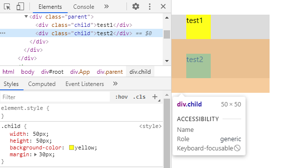
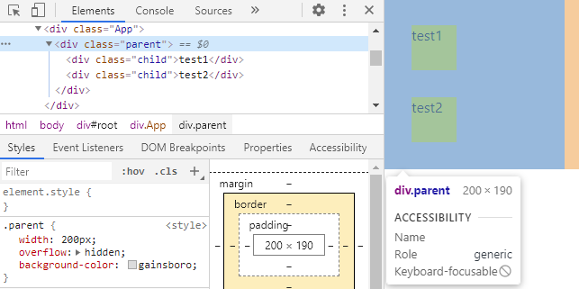
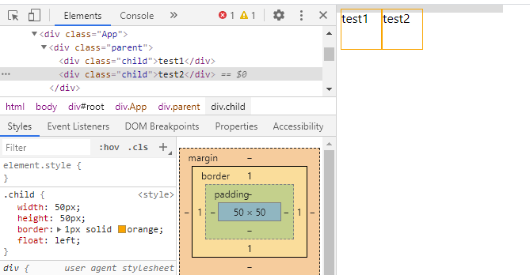
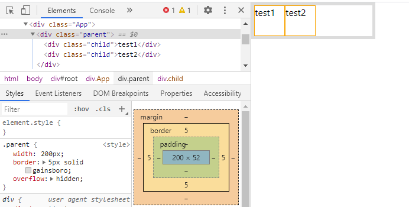
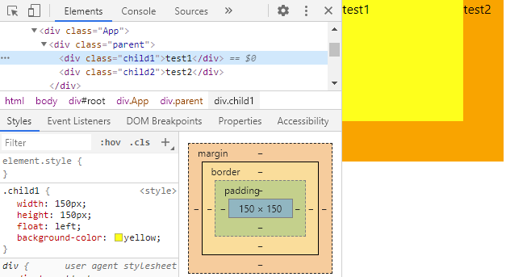
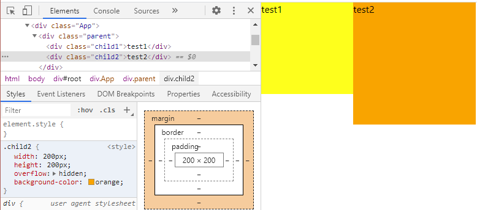

> BFC（Block Formatting Context）：块级格式化上下文，是一个独立的布局环境，特点：一个环境中的元素不会影响到其它环境中的布局

**问题1：** 开发过程中常见的垂直方向边距重叠

为child两个子元素上添加margin设置会出现下图中的情况，可以明显看出的两个问题：

① 两个子元素与父元素之间的margin未生效，test1顶部和test2底部紧贴着父元素。

② 两个子元素之间的margin重叠后，仅显示一个margin高度30px（实质上，会取margin中较大的值作为二者之间的间距）

上述问题可以通过创建BFC来解决。如下图，为父元素创建BFC，添加overflow:hidden/auto后，其与两个子元素之间的上下间距出现。

原因是：**对于不属于同一个BFC的元素之间不会发生margin重叠**。

为父元素创建BFC后，其与两个子元素不属于同一个BFC。但此时test1与test2仍然属于同一个BFC，所以两个子元素之间的间距仍然为30px，可以在test2外部添加一层元素并设置overflow:hidden/auto让其独立，来解决子元素之间的重叠问题。

**问题2：** 浮动元素父级塌陷

当给子元素设置成浮动元素时，子元素自动脱离开文档流。父元素内没有可以撑开高度的子元素后，失去支撑导致高度塌陷。

BFC有以下特点：**计算BFC的高度时，浮动元素也参与计算**
为父元素创建BFC，设置后即使子元素为浮动元素依然计算高度，可以解决塌陷问题。

**问题3：** 浮动元素互相重叠

为child1设置浮动，child1漂浮出文档流，child2在其下方发生重叠。

为child2设置BFC让其成为独立容器，因为**BFC的区域不会与float元素区域重叠**，可以避免浮动元素的互相重叠。

**如何创建BFC？**

1. float的值不能为none（默认）
2. overflow的值不能为visible（默认）
3. display的值为table-cell, table-caption, inline-block
4. position的值为absolute或fixed

**BFC的特点**

1. BFC的区域不会与float的元素区域重叠
2. 计算BFC的高度时，浮动子元素也参与计算
3. 内部的Box会在垂直方向上一个接一个的放置，垂直方向的距离由margin决定(属于同一个BFC的两个相邻Box的margin会发生重叠，与方向无关)
4. BFC就是页面上的一个隔离的独立容器，容器里面的子元素不会影响到外面元素，反之亦然
