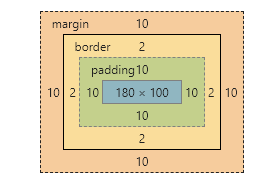

盒模型主要有**标准模型**和**IE模型**两种，二者之间主要的区别在于**宽度width和高度height的计算方式不同**。

标准模型width/height： **content** 的 width/height
IE模型width/height：**border + padding + content** 的 width/height

对于下图：

如果按照标准模型设置，下面盒的宽高为：
width：180px；
height：100px；

如果按照IE模型设置，下面盒的宽高为：
width：180px + 10px * 2 + 2px * 2 = 204px；
height：100px + 10px * 2 + 2px * 2 = 124px；

在CSS3中，通过设置**box-sizing**来区分设置标准和IE模型。

标准：**box-sizing：content-box**
IE：**box-sizing：border-box**

开发中，我们通常将盒模型设置为IE模型，因为其对开发更友好。例如，当设置内部两个横向div的宽度分别为50%时，此时两个盒模型紧凑的挨在一起。为了让界面更加美观，我们需要为两个div添加margin/padding，此时需要设置margin左右5%，同时将两个div设置宽度40%才能完成，如果使用IE模型则不需要多余的设置了。