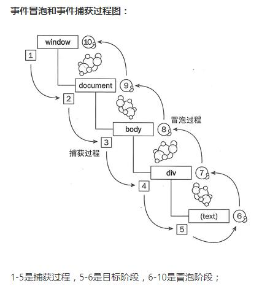

添加事件的三种方法：
1.  DOM0中：element.onclick=function(){}，
2.  DOM2中：element.addEventListener("click",function(){},false)，
3.  DOM3中：element.addEventListener("keyup",function(){},false)，(冒泡)

问：如果为outer和inner分别添加点击事件，当点击时是先执行outer还是inner呢？

```
<div id="outer">
    <p id="inner">Click me!</p>
</div>
```

### **事件捕获**

事件的执行顺序是从最外层向下的方向，一直到某个目标元素为止。

顺序为：window -> document -> html -> body -> div -> p


### **事件冒泡**

与捕获顺序相反，从目标元素一直向上冒泡。

顺序为： p -> div -> body -> html -> document -> window 



我们可以手动选择事件处理函数在哪一个阶段被调用，在addEventListener的第三个参数设置。如果为true，说明事件在捕获阶段执行，false默认，事件在冒泡阶段执行。


获取document：window.document

获取HTML标签：document.documentElement

获取body：document.body


### **事件代理**

把原本需要绑定在子元素的响应事件委托给父元素，让父元素担当事件监听的职务。
原理：事件冒泡

```
<ul id="list">
  <li>item 1</li>
  <li>item 2</li>
  <li>item 3</li>
  ......
  <li>item n</li>
</ul>
```
当我们希望为每一个li添加事件时，如果通过循环li标签的方式来添加，需要循环处理所有li，如果li的数量很多处理起来很麻烦，且很消耗性能。如果增加li，还需要为新增的手动添加事件。

此时可以通过**事件代理（事件委托）**来实现上述功能。依靠事件冒泡的原理，将时间注册在父元素上，只需要注册一次，尽管后续增加li也无需添加其他处理。子元素的事件会冒泡到父元素上，通过回调的参数event，能够轻松的获取到当前处理的是哪个子元素（event.target）


阻止冒泡的方法： 
 1. 给子级加 **event.stopPropagation( )**
 2. event.target==event.currentTarget，让触发事件的元素等于绑定事件的元素，也可以阻止事件冒泡；
 
阻止默认事件： **event.preventDefault( )**