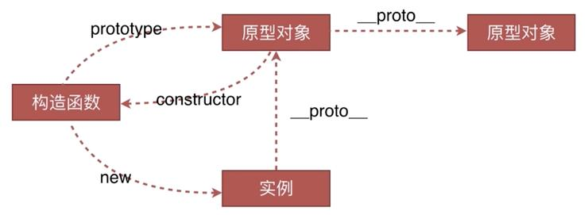
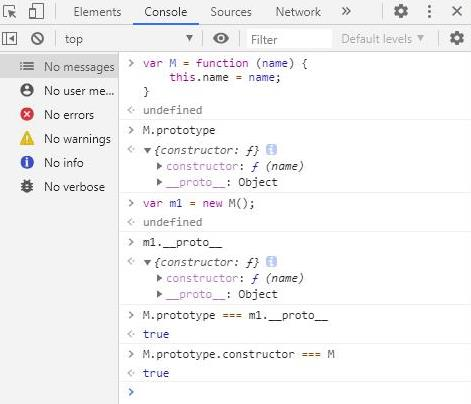
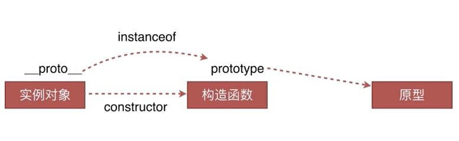
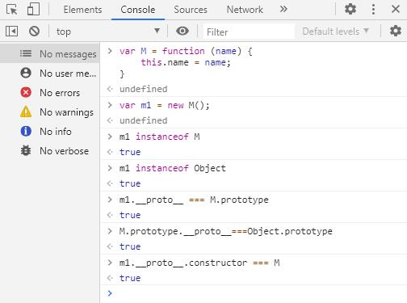

最近在复习一些JS的基础，原型和原型链大概是JS中相对的难点了。看了很多关于原型链的讲解，不好理解主要也是因为太抽象，且不是我们开发中直观常用的东西。

原型链的主要链如下图，是我在一个学习视频中收藏的。这个图清晰明确的表示出实例，构造函数和原型对象之间的关系。



接下来解释一下：
1. 构造函数：对于任意函数，当使用new关键字创建实例对象时，该函数就作为构造函数存在。
2. 实例对象：就是一个普通对象，通过构造函数创建，包含构造函数内部的所有属性和方法。
3. 原型对象：也是一个对象，构造函数的__prototype__和实例对象的_ proto _同时指向原型对象。


首先对于构造函数（或者普通函数）来说，在声明时会默认为其添加一个__prototype__属性，如下：
```
var M = function (name) {
	this.name = name;
}
console.log(M.prototype);
```
对于对象来说，在创建时也会默认为其添加一个_ proto _属性。如下：
```
var m1 = new M();
console.log(m1.__proto__);
```
 
 **重点：** 

 规定构造函数的__prototype__与实例对象的_ proto _指向同一个原型对象。

```
console.log(M.prototype === m1.__proto__); // true
```

原型对象上有一个constructor属性，该属性指回构造函数本身。

```
console.log(M.prototype.constructor === M); // true
```

具体例子如下图，在控制台打出相关信息：



解释两条：

① 我们说，函数在声明时默认会添加__prototype__属性，但函数也是对象，所以函数上也存在_ proto _属性。

② 原型对象也是对象，所以原型对象上也有_ proto _，其指向该原型对象的原型对象，也正是因为如此，造成了原型与原型之间形成链的形式。


### instanceof 原理

instanceof原理就是按照原型链的思想设计的。
instanceof左边是一个实例对象，右边是构造函数。判断右边构造函数的__prototype__是否在左边对象的原型链上，如果查找失败返回false。



对于构造函数M，和其创建出来的实例m1：**m1 instanceof M** 
```
var M = function (name) {
	this.name = name;
}
var m1 = new M();
m1 instanceof M; //true
```

同时，对于Object构造函数：
```
m1 instanceof Object; //true
```

具体例子如下图，在控制台打出相关信息：


