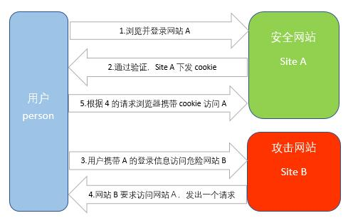

### CSRF
 
1. 名称：跨站请求伪造（Cross-site request forgery）
2. 图解：
3. 原理：
（1）当用户person访问安全网站Ａ时，需要进行身份信息的验证。验证通过时，网站Ａ会下发cookie作为用户person登录该网站的唯一证明，存储于person客户端。
（2）当用户person处于登录网站A的状态时，去访问危险网站B，这个攻击网站会要求用户person去访问网站Ａ，此时用户person拥有cookie，可以直接去访问网站Ａ。
（3）网站Ａ并不知道这次请求是由用户person发出，还是网站B发出的。由于浏览器会自动带上客户端的cookie，所以网站A会正常处理请求，网站B就达到了模拟用户操作的目的。

**其中：cookie保证了用户可以处于登录状态，但网站B其实拿不到 cookie**

很明显，这种方式的攻击需要保证用户已经登录了安全网站没有登出，且在本地生成了cookie的情况下才会完成。

4. 如何防御：
（1）token验证：服务器发送给客户端一个token，客户端提交的表单中带着这个token，如果 token 不合法，服务器拒绝请求
（2）隐藏令牌：把 token 隐藏在 http 的 head头中
（3）Referer 验证：设置页面请求来源，服务器进行处理

### XSS

1. 名称：跨域脚本攻击（Cross Site Scripting）
2. 原理：通过合法的操作（比如在url中输入、在评论框中输入）向页面注入脚本（js或hmtl代码块）
3. 几种XSS:
（1）反射型：这种反射型一般存在链接中，请求链接时，代码经过服务器端就会反射回来。
（2）存储型：一般在留言板、搜索框里会遇到，直接插入到留言板中当用户每次访问时都会反射这种称为存储型。
（3）DOM型：是一种发生在客户端文档对象模型中的跨站漏洞。

4. 如何防御：
（1）通过编码控制：对用户输入的数据进行HTML Entity编码
（2）过滤：移除用户输入的和事件相关的属性，如onerror（可以自动触发攻击），onclick等。移除用户输入的Style节点、Script节点、Iframe节点。

二者区别：
（1）XSS针对客户端，而CSRF针对服务端
（2）XSS是利用合法用户获取其信息，而CSRF是伪造成合法用户发起请求