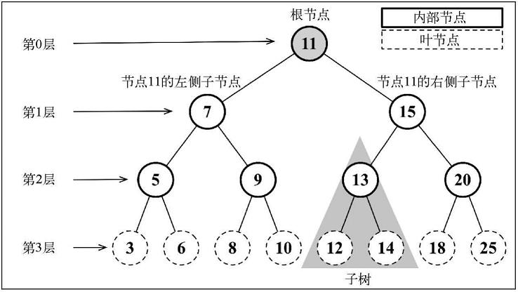
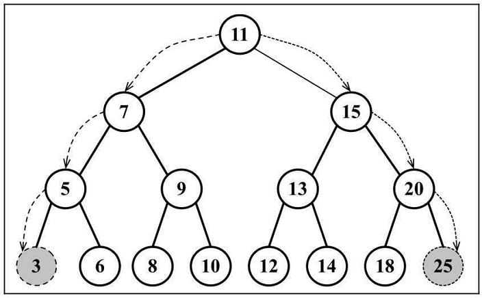

## 树/二叉树

**根节点**：树顶部的节点，没有父节点。⑪
**内部节点**：至少有一个子节点。⑦⑤⑨⑮⑬⑳
**外部节点（叶节点）**：没有子节点。③⑥⑧⑩...下面一排

**子树**：由一个节点和它的后代构成。例如：⑬⑫⑭构成树中的一棵子树。

**节点深度**：取决于祖先节点的数量。③的深度是3，因为有⑤⑦⑪三个祖先。
**树的高度**：节点深度的最大值。（根节点是第0层）



 **二叉树**：节点最多有两个子节点，左侧子节点 + 右侧子节点
 **二叉搜索树**：BST（BinarySearchTree），二叉树的一种。
 只允许左侧节点存储比父节点小的值，右侧节点存储比父节点大的值。上图就是二叉搜索树
 
---

创建一个Node类，通过构造函数可以创建出一个实例，其上包含key节点值，左侧子节点引用，右侧子节点引用（初始值null）三个属性。

```
export class Node {
	constructor(key) {
		this.key = key;
		this.left = null;
		this.right = null;
	}
}
```

创建一个BinarySearchTree类：

```
import { Node } from "./node";
import { defaultCompare } from "util";

export class BinarySearchTree{
	constructor(compareFn = defaultCompare) {
		this.compareFn = compareFn;
		this.root= null;
	}
}
```

## 向树中插入键值

1. 判断想要插入的节点是否是根节点
	如果是，直接new一个类实例，并将root属性指向该新节点。（左右指针自动设置null）
2. 插入的不是根节点而是其他节点
	使用一个递归的方法来计算节点将要插入的位置
	
```
insert(key) {
	if(this.root == null) {
		this.root = new Node(key);
	} else {
		this.insertNode(this.root, key);
	}
}
```

1. insertNode方法第一次传入的是树的根节点和要插入的新节点。
2. 如果新节点值 < 当前节点值，那么检查当前节点的左侧子节点。
	左侧子如果没有值，将新节点赋给左侧子。否则递归调用insertNode方法，将左侧子节点和需要插入的新节点作为参数继续执行。
3. 如果新节点值 > 当前节点值，那么检查当前节点的右侧子节点。
	右侧子如果没有值，将新节点赋给右侧子。否则递归调用insertNode方法，将右侧子节点和需要插入的新节点作为参数继续执行。
	
```
insertNode(node, key) {
	if(this.compareFn(key, node.key) === Compare.LESS_THAN) {
		if(node.left == null) {
			node.left = new Node(key);
		} else {
			this.insertNode(node.left, key);
		}
	} else {
		if(node.right == null) {
			node.right = new Node(key);
		} else {
			this.insertNode(node.right, key);
		}
	}
}
```

## 搜索最小/最大值

从图中可以看出，当想要查找整个树中的最小值时，需要一直查看当前节点是否有左侧子节点。如果有，继续向下一层查找左侧子节点...同理，查找最大值时，一直查找右侧子节点



首先，暴露出可用的min方法，代码如下：

```
min() {
	return this.minNode(this.root);
}
```
minNode方法中，通过循环判断当前根节点是否存在左侧子节点的方法，找到最小的左侧值。

```
minNode(node) {
	let current = node;
	while(current !== null && current.left !== null) {
		current = current.left;
	}
	return current;
}
```

同理，可以实现max方法。（传入根节点，遍历整棵树）
```
max() {
	return this.maxNode(this.root);
}
```
maxNode方法中，通过循环判断当前根节点是否存在右侧子节点的方法，找到最大的右侧值。

```
maxNode(node) {
	let current = node;
	while(current !== null && current.right !== null) {
		current = current.right;
	}
	return current;
}
```

## 搜索特定值

首先，暴露出外部可用的search方法，接受两个参数：根节点this.root和想要搜索的节点key，代码如下：

```
search() {
	return this.searchNode(this.root, key);
}
```

searchNode方法内部，如果节点是null，直接返回false。如果要找的值比当前节点小，则继续在左侧子树上搜索。如果要找的值比当前节点大， 则继续在右侧子树上搜索。否则，则说明要找的值与当前节点相等。

```
searchNode(node, key) {
	if(node == null) {
		return false;
	}
	if(this.compareFn(key, node.key) === Compare.LESS_THAN) {
		return this.searchNode(node.left, key);
	} else if (this.compareFn(key, node.key) === Compare.BIGGER_THAN) {
		return this.searchNode(node.right, key);
	} else {
		return true;
	}
}
```

## 移除一个节点

首先，暴露出外部可用的search方法，接受两个参数：根节点this.root和想要搜索的节点key，代码如下：

```
remove(key) {
	this.root = this.removeNode(this.root, key);
}
```

1. 判断当前节点是否为null，如果是直接返回null

2. 如果不为null，需要在树中找到要移除的值。如果移除值比当前节点值小，就沿着树左边找下一个节点。如果移除值比当前节点值大，就沿着树右边找下一个节点。

3. 找到移除值的位置后，分为以下三种情况：

① **移除的节点既没有左侧子，又没有右侧子（叶节点）**：
此时直接将该节点赋值null来移除它。（重点：单纯将值赋予null是不够的，还要处理指针，这个节点没有任何子节点，但有一个父节点，通过返回null将其父节点指针赋予null）

② **移除的节点有一个左侧或右侧子节点**：
此时需要跳过当前节点，直接将它的父节点的指针指向它的子节点。
如果它没有左侧子，说明她有右侧子。需要把它父节点指针指向它的右侧子，并返回更新后的节点。

有左没右同理。

③ **移除的节点有两个子节点**：
此时当前移除的节点既有左侧子，又有右侧子。
如果移除了这个节点，首先需要找到它右侧子树中最小的节点（它的继承者）。用这个右侧子树中的最小值更新这个节点，改变他的值也就是被移除了。但此时存在两个相同值的节点，要把右侧子树中原有的最小节点移除。最后向父节点返回更新后的指针。

```
removeNode(node, key) {
	if(node == null) {
		return null;
	}
	if(this.compareFn(key, node.key) === Compare.LESS_THAN) {
		node.left = this.removeNode(node.left, key);
		return node;
	} else if (this.compareFn(key, node.key) === Compare.BIGGER_THAN) {
		node.right = this.removeNode(node.right, key);
		return node;
	} else {
		if(node.left == null && node.right == null) {
			node = null;
			return node;
		} // ①
		if(node.left == null) {
			node = node.right;
			return node;
		} else if(node.right == null) {
			node = node.left;
			return node;
		} // ②
		const aux = this.minNode(node.right);
		node.key = aux.key;
		node.right = this.removeNode(node.right, aux.key);
		return node; // ③
	}
}
```

## 中序/先序/后序遍历

```
inOrderTraverse(callback) {
	this.inOrderTraverseNode(this.root, callback);
}
```

1. 中序遍历：左 -> 根 -> 右 ① -> ② -> ③（应用：对树进行排序，从小到大访问节点）
2. 先序遍历：根 -> 左 -> 右 ② -> ① -> ③
3. 后序遍历：左 -> 右 -> 根 ② -> ③ -> ①

```
inOrderTraverseNode(node, callback) {
	if(node != null) {
		this.inOrderTraverseNode(node.left, callback); //①
		callback(node.key); //②
		this.inOrderTraverseNode(node.right, callback); // ③
	}
}
```

执行以下，会按照要求的顺序输出：

```
const printNode = (value) => console.log(value);
inOrderTraverse(printNode);
```

