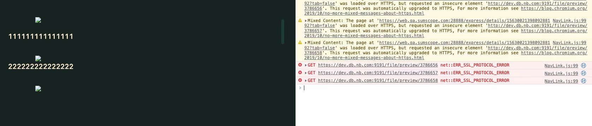
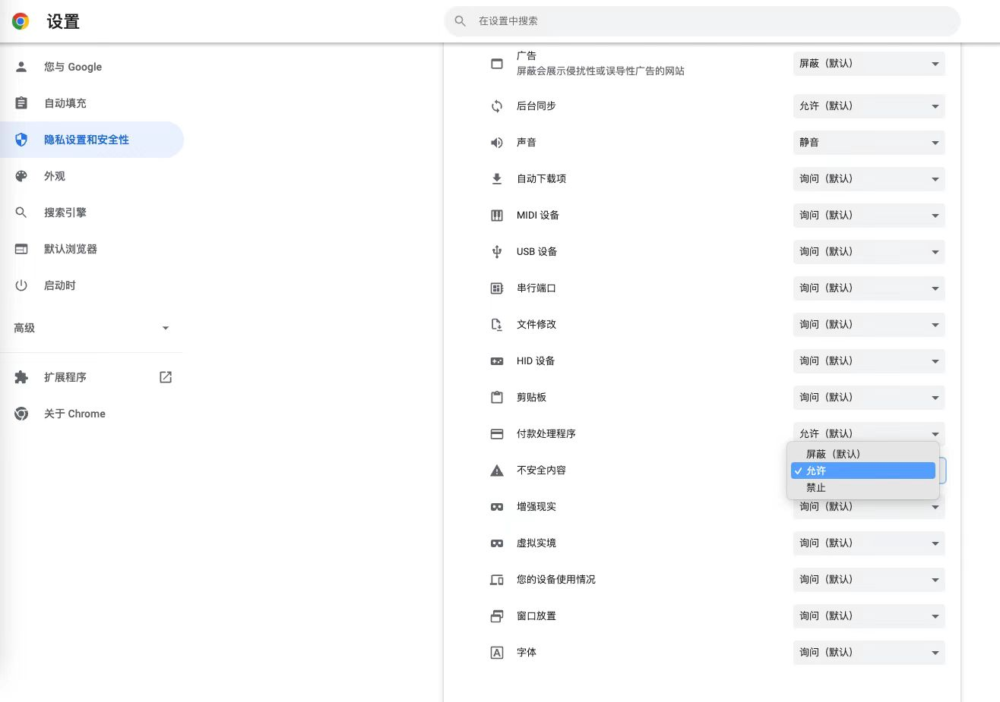

加载图片地址时后端提供http请求，Chrome打开后报错：

ERR_SSL_PROTOCOL_ERROR提示SSL协议错误，主要原因是Nginx配置SSL证书的问题。

https://blog.csdn.net/qq_21460229/article/details/102969528 中有详细的重配方法

除此之外，控制台中报错处显示加载图片的地址为https，而后端提供的地址为http。在火狐中验证，图片可以正常获取，所以猜测是Chrome中的某些设置将不安全请求转为https，尝试在设置中将《不安全内容》设置允许后，可以正常显示

做此记录
