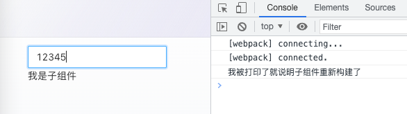

1. class组件中的性能优化
- 在调用setState时，无论前后state是否有变化，都会触发重渲染
- 父组件重渲染，内部子组件也会自动重渲染
    
以上，是class组件中关于性能方面需要优化的两点。通常的解决办法是：
- 用immutable进行比较，在不相等的时候调用setState
- 子组件PureComponent用**shouldComponentUpdate**判断前后的props和state是否有变化，通过返回false来阻止更新

2. 函数组件中的useMemo和useCallback
    
`useMemo(() => {}, [dep]);`
`useCallback(() => {}, [dep]);`

二者写法相同，都是在初次渲染和依赖改变时执行。且作用都是做缓存以减少计算，进而提高效率。
区别在于，useMemo返回缓存的变量，useCallback返回缓存的函数


3. 何时+如何使用useCallback？
**并不是每个函数都需要使用useCallback！！**


> 每一个被useCallBack的函数都将被加入useCallBack内部的管理队列。而当我们大量使用useCallBack的时候，管理队列中的函数会非常之多，任何一个使用了useCallBack的组件重新渲染的时候都需要去便利useCallBack内部所有被管理的函数找到需要校验依赖是否改变的函数并进行校验。
>
> 在以上这个过程中，寻找指定函数需要性能，校验也需要性能。所以，滥用useCallBack不但不能阻止函数重新构建还会增加“寻找指定函数和校验依赖是否改变”这两个功能，为项目增添不必要的负担。
>


useCallback本质工作并不是在依赖不变时保证不创建新函数，而是在依赖不变时继续返回旧函数地址（保持地址不变）
**useCallback无法阻止函数的重新创建！！**


- [x] 举栗子：

父组件中包含自身的state，并将一个普通的回调函数传入子组件当中

```
/* 父组件 */

import React, { useState } from 'react';
import { Input } from 'antd';

const Parent: React.FC = () => {
    const [val, setVal] = useState<string>('');
    
    const handleCallback = () => {
        console.log('父组件传递给子组件的回调函数');
    };
    
    return (
        <div>
            <Input value={val} onChange={(e) => setVal(e.target.value)} />
            <Child callBack={handleCallback} />
        </div>
    );
}

export default Parent;
```


子组件接收回调函数作为自身的props，每次执行子组件render时输出打印

```
/* 子组件 */

import React from 'react';

interface IProps {
    callback: () => void
}

const Child: React.FC<IProps> = () => {
    console.log('我被打印了！说明子组件重新构建了');
    return <div>我是子组件</div>
};

export default Child;

```

测试结果一️：
每次修改父组件val值时，可以在控制台中看到子组件都会跟随重渲染。很显然没必要，父组件的state对子组件来说没有任何作用

尝试将父组件的回调函数用useCallback包裹：


```
    const handleCallback = useCallback(() => {
        console.log('父组件传递给子组件的回调函数');
    }, []);
```

测试结果二️：
即使缓存了回调函数，但修改val值时，子组件依然渲染


重点来了->
    **React.memo()** ： 通过校验props中的数据(数据的内存地址)是否改变来决定组件是否需要重新渲染

```
/* memo包住子组件 */

import React from 'react';

interface IProps {
    callback: () => void
}

const Child: React.FC<IProps> = React.memo(() => {
    console.log('我被打印了就说明子组件重新构建了');
    return <div>我是子组件</div>
});
export default Child;

```

测试结果三️：
无论如何修改父组件的state都不会再影响子组件，子组件不会再进行没必要的重渲染，完成性能上的优化




结论： 用useCallBack包裹传入子组件的回调函数，以保证父组件state更新时，回调函数的返回地址不变，依然是缓存的函数地址。而子组件通过memo函数包裹后，会对传入的props进行校验，传入的函数栈地址不变，所以不渲染。
